# BTL-CTS-REPO-Tools
Tools for compiling a CTS repository from the Bibliotheca Teubneriana Latina XML Dump. This is a collection of scripts used to compile a CTS capable repository.

# Usage

The flow diagram shows the intended way of usage. We propose a three stage process. In the first stage we prepare datasets by a scientific process, or be reuse of such a process. In the second stage the datasets are setup to be used as knowledge base. In the third stage a script derives the canonical structure of the repository and saves it to server disk. In the third step we also address other utilization of the knowledge base (frontend, URN generation, reference extraction,)

For a detailed description read the README of each section:

- dge-crawler (1. stage, dataset generation) https://github.com/ecomp-shONgit/BTL-CTS-REPO-Tools/tree/master/dge-crawler

- abk (2. stage, knowledge base generation) https://github.com/ecomp-shONgit/BTL-CTS-REPO-Tools/tree/master/abk

- BTL2CTS (3. stage, apply knowledge base to BTL XML) https://github.com/ecomp-shONgit/BTL-CTS-REPO-Tools/tree/master/BTL2CTS

- MPL2CTS (3. stage, apply knowledge base to MPL SGML) https://github.com/ecomp-shONgit/BTL-CTS-REPO-Tools/tree/master/MPL2CTS

- Frontend (URN resolver, human readable) https://github.com/ecomp-shONgit/BTL-CTS-REPO-Tools/tree/master/frontend

# URI: PATH / URN / URL

We intend to have a unified addressing scheme. To realize this we use the URI definition.  The provide access methods now range from PATH, URN to URL (with and without authority). The special case of ancient sources and there editions and referencing gives us the possibility of repository design that allow multiple text versions, if needed multiple versions of the repository under one addressing scheme. The CTS URN is a central to all of this, because everything else derived from this, it is the exchange format of a citation. 

